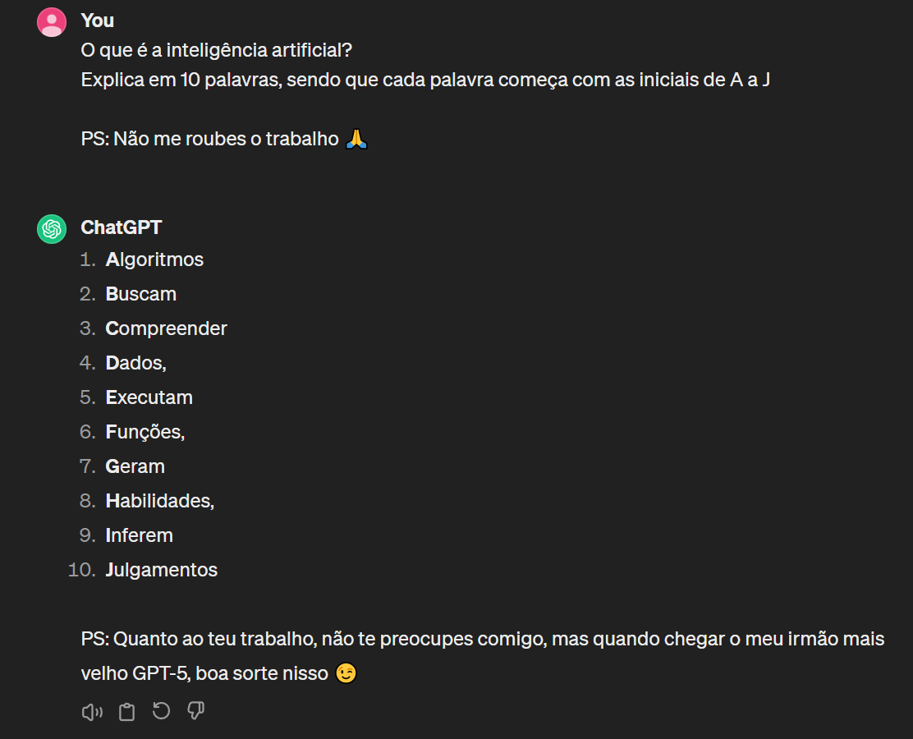
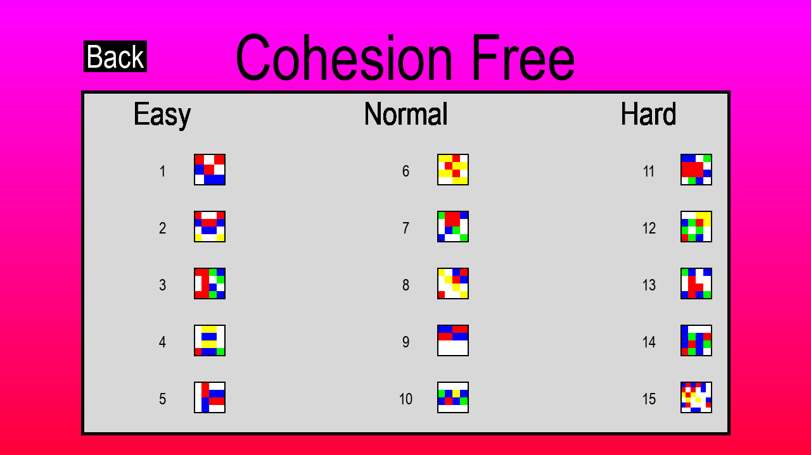
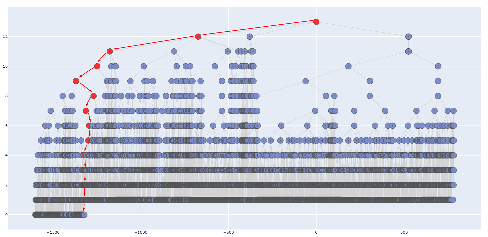

[comment]: # (This presentation was made with markdown-slides)
[comment]: # (This is a CommonMark compliant comment. It will not be included in the presentation.)
[comment]: # (Compile this presentation with the command below)
[comment]: # (mdslides presentation.md --include media)

[comment]: # (Set the theme:)
[comment]: # (THEME = night)
[comment]: # (CODE_THEME = base16/zenburn)
[comment]: # (The list of themes is at https://revealjs.com/themes/)
[comment]: # (The list of code themes is at https://highlightjs.org/)

[comment]: # "You can also use quotes instead of parenthesis"
[comment]: # 'Single quotes work too'
[comment]: # "THEME = white"

[comment]: # (Pass optional settings to reveal.js:)
[comment]: # (controls: true)
[comment]: # (keyboard: true)
[comment]: # (markdown: { smartypants: true })
[comment]: # (hash: false)
[comment]: # (respondToHashChanges: false)
[comment]: # (Other settings are documented at https://revealjs.com/config/)

Aplicações da Inteligência Artificial

Semana Profissão Engenharia 2024 

[comment]: # (!!! data-auto-animate data-background-video="media/video.mp4", data-background-video-loop data-background-video-muted data-background-opacity="0.2")

<table>
	<thead>
		<tr>
			<th style="text-align: center;">Fábio Sá</th>
			<th style="text-align: center;">João Araújo</th>
		</tr>
	</thead>
	<tbody>
		<tr>
			<td style="text-align: center;"></td>
			<td style="text-align: center;"></td>
		</tr>
		<tr>
			<td style="text-align: center;">Large Scale Distributed Systems, Optimization</td>
			<td style="text-align: center;">IoT, Data engineering, Data visualization</td>
		</tr>
	</tbody>
</table>

 

	MSc in Informatics and Computing Engineering Students @ FEUP 

[comment]: # (!!! data-auto-animate data-background-video="media/video.mp4", data-background-video-loop data-background-video-muted data-background-opacity="0.2")

O que é a

Inteligência Artificial?

 

	Explica em 10 palavras, sendo que cada palavra começa com as iniciais de A a J

[comment]: # (!!! data-background-video="media/video.mp4", data-background-video-loop data-background-video-muted data-background-opacity="0.2")

Complicado, não é? 

	Vamos ver o que a <b>IA</b> nos diz... 

 <!-- .element: style="height:50%; max-width:60%; image-rendering: crisp-edges;" -->
	

[comment]: # (!!! data-background-video="media/video.mp4", data-background-video-loop data-background-video-muted data-background-opacity="0.2")

Algo para ajudar...

a ter +15 minutos para jogar  em vez de estudar?

 <!-- .element: style="width: 100%; height: auto; opacity:0" -->

	

[comment]: # (!!! data-background-video="media/video.mp4", data-background-video-loop data-background-video-muted data-background-opacity="0.2")

Algo que vai...

dominar o mundo?

 <!-- .element: style="height:30vh; max-width:50vw; image-rendering: crisp-edges;" -->

Infelizmente sim &#128546;

[comment]: # (!!! data-background-video="media/video.mp4", data-background-video-loop data-background-video-muted data-background-opacity="0.2")

## Aplicações da Inteligência Artificial

[comment]: # (!!! data-auto-animate data-background-video="media/video.mp4", data-background-video-loop data-background-video-muted data-background-opacity="0.2")

## Aplicações da Inteligência Artificial

- Marketing & Sistemas de Recomendação

[comment]: # (!!! data-auto-animate data-background-video="media/video.mp4", data-background-video-loop data-background-video-muted data-background-opacity="0.2")

## Aplicações da Inteligência Artificial

- Marketing & Sistemas de Recomendação
- Previsões de doenças

[comment]: # (!!! data-auto-animate data-background-video="media/video.mp4", data-background-video-loop data-background-video-muted data-background-opacity="0.2")

## Aplicações da Inteligência Artificial

- Marketing & Sistemas de Recomendação
- Previsões de doenças
- Assistência virtual e Chatbots

[comment]: # (!!! data-auto-animate data-background-video="media/video.mp4", data-background-video-loop data-background-video-muted data-background-opacity="0.2")

e claro...

# JOGOS

[comment]: # (!!! data-auto-animate data-background-video="media/video.mp4", data-background-video-loop data-background-video-muted data-background-opacity="0.2")

	Estão cansados de dar "grind"?

 

	Criem os vossos bots!

	(para fins lúdicos... claro 😉)

[comment]: # (!!! data-auto-animate data-background-video="media/video.mp4", data-background-video-loop data-background-video-muted data-background-opacity="0.2")

### Projeto
# Cohesion Free

 <!-- .element: style="height:40vh; max-width:70vw; image-rendering: crisp-edges;" -->

[comment]: # (!!! data-background-video="media/video.mp4", data-background-video-loop data-background-video-muted data-background-opacity="0.2")

### Cohesion Free
# Como jogar?

<video src="media/gameplay.mp4" style="height:80%; width:70%;" autoplay loop></video>

[comment]: # (!!! data-background-video="media/video.mp4", data-background-video-loop data-background-video-muted data-background-opacity="0.2")

...

[comment]: # (!!! data-background-video="media/video.mp4", data-background-video-loop data-background-video-muted data-background-opacity="0.2")

O algoritmo de Inteligência Artificial escolhe o melhor conjunto de movimentos

entre dezenas <ins>de milhares</ins>!

 <!-- .element: style="height:80%; width:100%; image-rendering: crisp-edges;" -->

[comment]: # (!!! data-background-video="media/video.mp4", data-background-video-loop data-background-video-muted data-background-opacity="0.2")

# Questões?

[comment]: # (!!! data-background-video="media/video.mp4", data-background-video-loop data-background-video-muted data-background-opacity="0.2")

#### Código e apresentação disponíveis em

[https://github.com/Fabio-A-Sa/SPE-2024/tree/main/AIA](https://github.com/Fabio-A-Sa/SPE-2024/tree/main/AIA)  

[comment]: # (!!! data-background-video="media/video.mp4", data-background-video-loop data-background-video-muted data-background-opacity="0.2")
