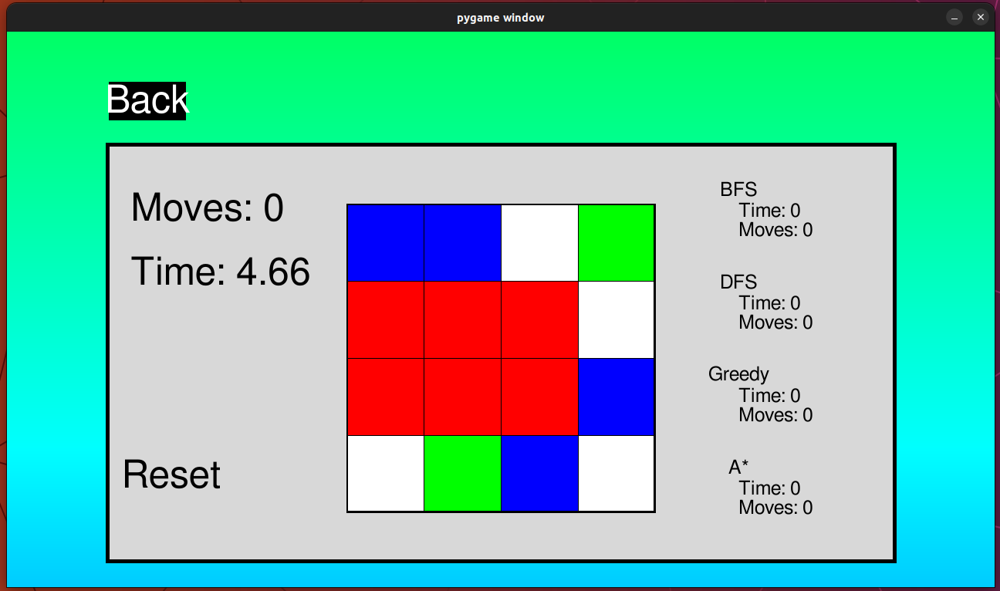

[comment]: # (This presentation was made with markdown-slides)
[comment]: # (This is a CommonMark compliant comment. It will not be included in the presentation.)
[comment]: # (Compile this presentation with the command below)
[comment]: # (mdslides presentation.md --include media)

[comment]: # (Set the theme:)
[comment]: # (THEME = night)
[comment]: # (CODE_THEME = base16/zenburn)
[comment]: # (The list of themes is at https://revealjs.com/themes/)
[comment]: # (The list of code themes is at https://highlightjs.org/)

[comment]: # "You can also use quotes instead of parenthesis"
[comment]: # 'Single quotes work too'
[comment]: # "THEME = white"

[comment]: # (Pass optional settings to reveal.js:)
[comment]: # (controls: true)
[comment]: # (keyboard: true)
[comment]: # (markdown: { smartypants: true })
[comment]: # (hash: false)
[comment]: # (respondToHashChanges: false)
[comment]: # (Other settings are documented at https://revealjs.com/config/)

Aplicações da Inteligência Artificial

Semana Profissão Engenharia 2024 

  

Fábio Sá & João Araújo  
MSc in Informatics and Computing Engineering Students @ FEUP 

[comment]: # (!!! data-auto-animate data-background-video="media/video.mp4", data-background-video-loop data-background-video-muted data-background-opacity="0.2")

|Fábio Sá|João Araújo|	
|--|--|
|||
|Large Scale Distributed Systems, Optimization|Data engineering, IoT, Data visualization|

[comment]: # (!!! data-auto-animate data-background-video="media/video.mp4", data-background-video-loop data-background-video-muted data-background-opacity="0.2")

O que é a

Inteligência Artificial?

[comment]: # (!!! data-background-video="media/video.mp4", data-background-video-loop data-background-video-muted data-background-opacity="0.2")

Algo para ajudar...

a ter mais 15 minutos para jogar em vez de estudar?

 <!-- .element: style="height:30vh; max-width:50vw; image-rendering: crisp-edges;" -->

[comment]: # (!!! data-background-video="media/video.mp4", data-background-video-loop data-background-video-muted data-background-opacity="0.2")

Algo que vai...

dominar o mundo?

 <!-- .element: style="height:30vh; max-width:50vw; image-rendering: crisp-edges;" -->

( Infelizmente sim :cry: )

[comment]: # (!!! data-background-video="media/video.mp4", data-background-video-loop data-background-video-muted data-background-opacity="0.2")

## Aplicações da Inteligência Artificial

[comment]: # (!!! data-auto-animate data-background-video="media/video.mp4", data-background-video-loop data-background-video-muted data-background-opacity="0.2")

## Aplicações da Inteligência Artificial

- Revisão de textos

[comment]: # (!!! data-auto-animate data-background-video="media/video.mp4", data-background-video-loop data-background-video-muted data-background-opacity="0.2")

## Aplicações da Inteligência Artificial

- Revisão de textos
- Previsões de doenças

[comment]: # (!!! data-auto-animate data-background-video="media/video.mp4", data-background-video-loop data-background-video-muted data-background-opacity="0.2")

## Aplicações da Inteligência Artificial

- Revisão de textos
- Previsões de doenças
- Assistência virtual e Chatbots

[comment]: # (!!! data-auto-animate data-background-video="media/video.mp4", data-background-video-loop data-background-video-muted data-background-opacity="0.2")

## Aplicações da Inteligência Artificial

- Revisão de textos
- Previsões de doenças
- Assistência virtual e Chatbots

[comment]: # (!!! data-auto-animate data-background-video="media/video.mp4", data-background-video-loop data-background-video-muted data-background-opacity="0.2")

e claro...

# JOGOS

[comment]: # (!!! data-auto-animate data-background-video="media/video.mp4", data-background-video-loop data-background-video-muted data-background-opacity="0.2")

Estão cansados de dar grind nos jogos? 

## Criem os vossos bots! (de forma honesta... claro)

[comment]: # (!!! data-auto-animate data-background-video="media/video.mp4", data-background-video-loop data-background-video-muted data-background-opacity="0.2")

### Projecto
# Cohesion Free

 <!-- .element: style="height:40vh; max-width:70vw; image-rendering: crisp-edges;" -->

[comment]: # (!!! data-background-video="media/video.mp4", data-background-video-loop data-background-video-muted data-background-opacity="0.2")

### Cohesion Free
# Como jogar?

 <!-- .element: style="height:40vh; max-width:70vw; image-rendering: crisp-edges;" -->

[comment]: # (!!! data-background-video="media/video.mp4", data-background-video-loop data-background-video-muted data-background-opacity="0.2")

...

[comment]: # (!!! data-background-video="media/video.mp4", data-background-video-loop data-background-video-muted data-background-opacity="0.2")

O algoritmo de Inteligência Artificial escolhe o melhor conjunto de movimentos

entre centenas!

 <!-- .element: style="height:50vh; max-width:80vw; image-rendering: crisp-edges;" -->

[comment]: # (!!! data-background-video="media/video.mp4", data-background-video-loop data-background-video-muted data-background-opacity="0.2")

# Questões?

[comment]: # (!!! data-background-video="media/video.mp4", data-background-video-loop data-background-video-muted data-background-opacity="0.2")

#### Código e apresentação disponíveis em

[https://github.com/Fabio-A-Sa/SPE-2024/tree/main/AIA](https://github.com/Fabio-A-Sa/SPE-2024/tree/main/AIA)  

[comment]: # (!!! data-background-video="media/video.mp4", data-background-video-loop data-background-video-muted data-background-opacity="0.2")
