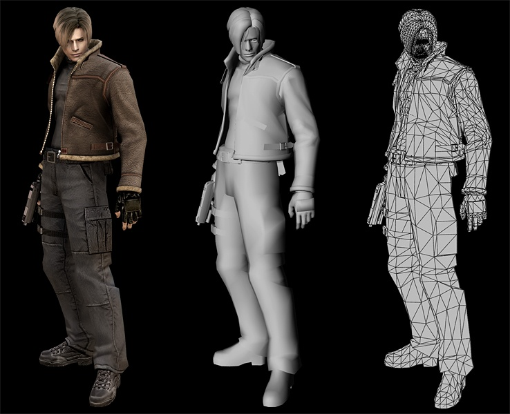

[comment]: # (This presentation was made with markdown-slides)
[comment]: # (This is a CommonMark compliant comment. It will not be included in the presentation.)
[comment]: # (Compile this presentation with the command below)
[comment]: # (mdslides presentation.md --include media)

[comment]: # (Set the theme:)
[comment]: # (THEME = night)
[comment]: # (CODE_THEME = base16/zenburn)
[comment]: # (The list of themes is at https://revealjs.com/themes/)
[comment]: # (The list of code themes is at https://highlightjs.org/)

[comment]: # "You can also use quotes instead of parenthesis"
[comment]: # 'Single quotes work too'
[comment]: # "THEME = white"

[comment]: # (Pass optional settings to reveal.js:)
[comment]: # (controls: true)
[comment]: # (keyboard: true)
[comment]: # (markdown: { smartypants: true })
[comment]: # (hash: false)
[comment]: # (respondToHashChanges: false)
[comment]: # (Other settings are documented at https://revealjs.com/config/)

Gráficos, Interação e Jogos

Semana Profissão Engenharia 2024 

  

Daniel Mendes & Fábio Sá 
MSc in Informatics and Computing Engineering Students @ FEUP 

[comment]: # (!!! data-auto-animate data-background-video="media/video.mp4", data-background-video-loop data-background-video-muted data-background-opacity="0.2")

## Aplicações da Computação Gráfica

[comment]: # (!!! data-background-video="media/video.mp4", data-background-video-loop data-background-video-muted data-background-opacity="0.2")

## Aplicações da Computação Gráfica

- Filmes e Animação

[comment]: # (!!! data-background-video="media/video.mp4", data-background-video-loop data-background-video-muted data-background-opacity="0.2")

## Aplicações da Computação Gráfica

- Filmes e Animação
- Arquitetura e Design

[comment]: # (!!! data-background-video="media/video.mp4", data-background-video-loop data-background-video-muted data-background-opacity="0.2")

## Aplicações da Computação Gráfica

- Filmes e Animação
- Arquitetura e Design
- Medicina e Simulação

[comment]: # (!!! data-background-video="media/video.mp4", data-background-video-loop data-background-video-muted data-background-opacity="0.2")

e claro...

# JOGOS

[comment]: # (!!! data-background-video="media/video.mp4", data-background-video-loop data-background-video-muted data-background-opacity="0.2")

Onde tudo são

## Triângulos

[comment]: # (!!! data-background-video="media/video.mp4", data-background-video-loop data-background-video-muted data-background-opacity="0.2")

Onde tudo são

## Triângulos

[comment]: # (!!! data-background-video="media/video.mp4", data-background-video-loop data-background-video-muted data-background-opacity="0.2")

Onde a Matemática é noss amiga

[comment]: # (!!! data-background-video="media/video.mp4", data-background-video-loop data-background-video-muted data-background-opacity="0.2")

## [Jogar!](../project/)

[comment]: # (!!! data-background-video="media/video.mp4", data-background-video-loop data-background-video-muted data-background-opacity="0.2")

# Questões?

[comment]: # (!!! data-background-video="media/video.mp4", data-background-video-loop data-background-video-muted data-background-opacity="0.2")

#### Código e apresentação disponíveis em

[https://github.com/Fabio-A-Sa/SPE-2024/tree/main/GIG](https://github.com/Fabio-A-Sa/SPE-2024/tree/main/GIG)  

[comment]: # (!!! data-background-video="media/video.mp4", data-background-video-loop data-background-video-muted data-background-opacity="0.2")
